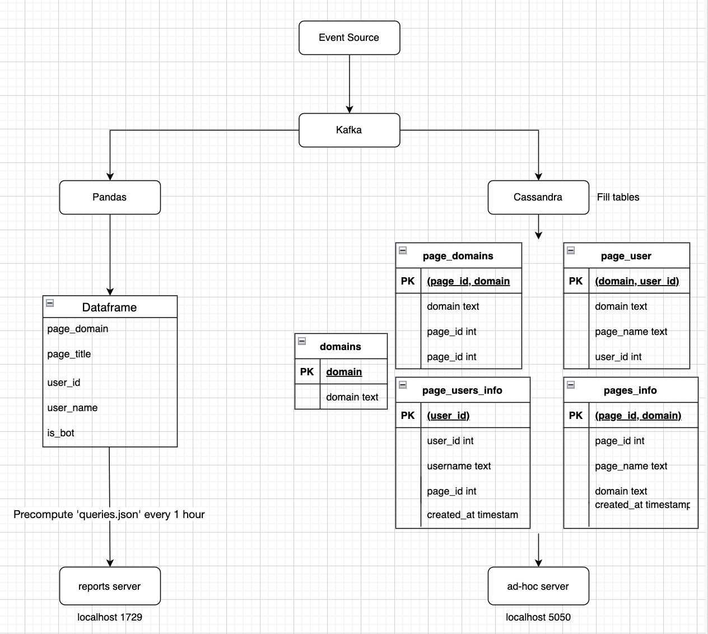
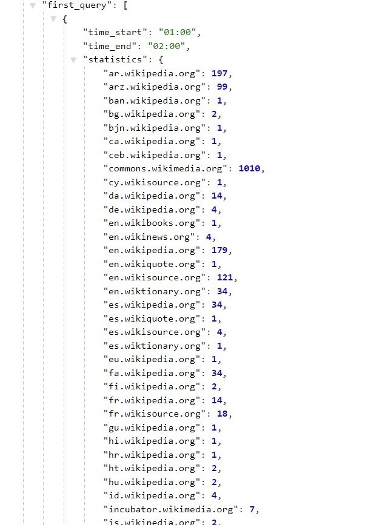
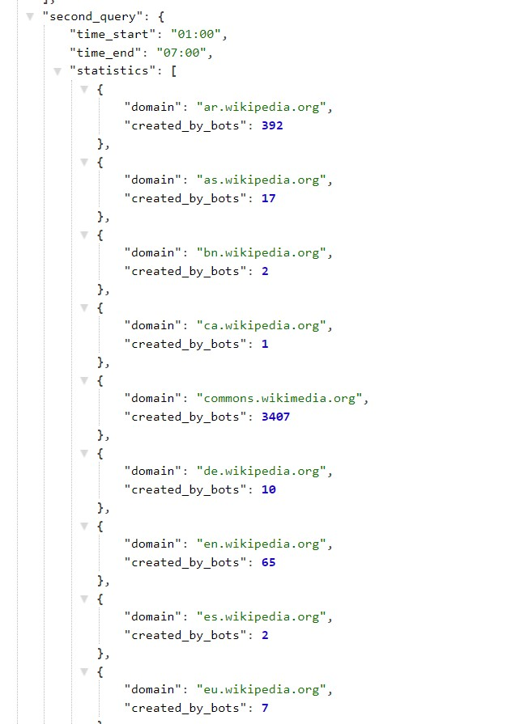
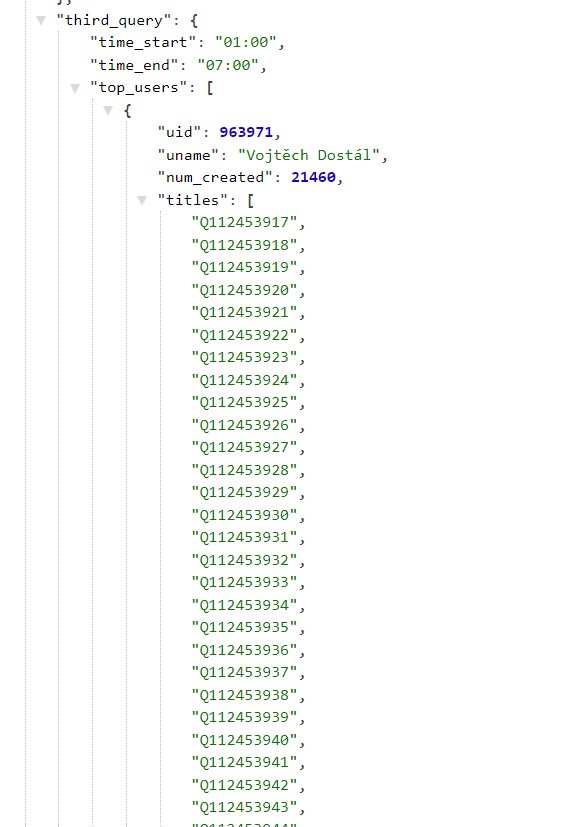
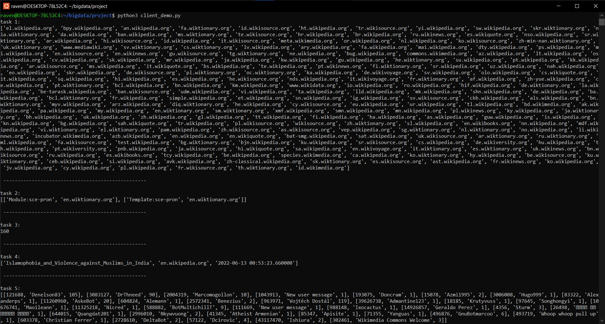

# Course project - Big Data Processing

## Team

- [Yarema Mishchenko](https://github.com/RavenbornJB)
- [Dmytro Lutchyn](https://github.com/dlutchyn)

## System design

### Diagram

### Kafka - producer & consumer

TODO: (yarema) write about how these work in our system

### Cassandra - DB for storage

TODO: (dmytro) write about tables in Cassandra

### Precomputed reports server - Category A

TODO: (yarema) write about why pandas and how this server gets data

### Ad hoc server - Category B

TODO: (dmytro) write about how this server gets data

## Results

All of our results are stored in the `project-results` directory. These results are generated using the `client_demo.py` script. As per the duration requirement, the system was running for ~8h 27m before making the requests.

### Category A

For category A, the `.json` file with query results is saved to `project-results/queries.json`.

The file is extremely large because of the 3rd query: the top author created over 20000 pages.

First query:

Second query:

Third query:

### Category B

As for category B, the output is displayed directly when running `client_demo.py`.

The arguments were chosen to fit well in a screen.

